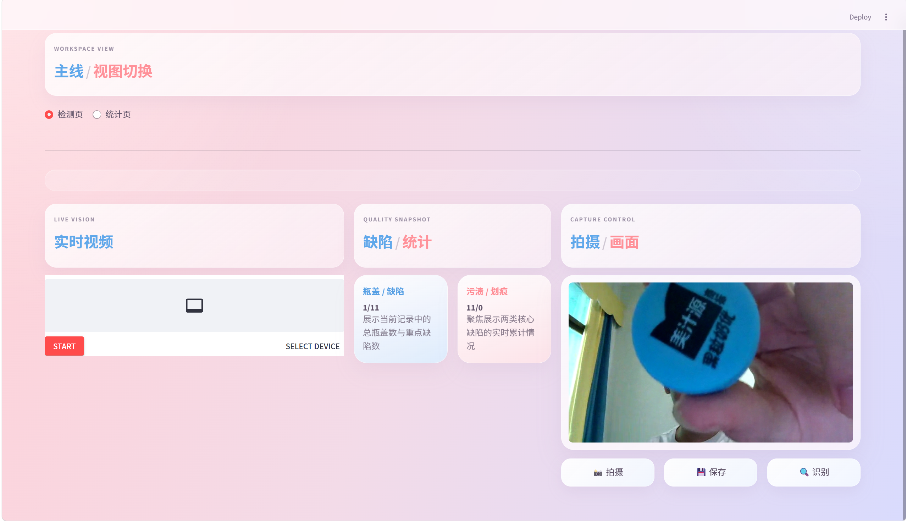
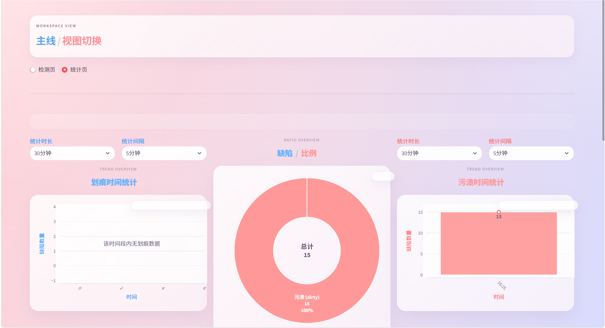

# IPDDS

IPDDS is a Streamlit-based bottle-cap defect detection and statistics dashboard.  
The project focuses on one clear workflow: capture frames from a camera, run YOLO-based defect detection, save results into CSV, and review detection trends in a lightweight visual dashboard.

## Screenshots

### Detection View



### Statistics View



## Highlights

- Real-time camera capture with `streamlit-webrtc`
- YOLO-based single-frame defect detection
- CSV-backed record storage with Chinese field names
- Split main views: `检测页` and `统计页`
- Built-in summary, export, filter, and offline reporting scripts
- Verified local runtime environment with `.venv312`

## Main Features

- 实时视频采集：通过 `streamlit-webrtc` 接入摄像头画面
- 缺陷识别：调用 `weights/best.pt` 对单帧图像做检测
- 数据落盘：将检测时间、类型、置信度、坐标写入 `defect_data.csv`
- 双视图主线：在“检测页”和“统计页”之间切换
- 数据看板：展示缺陷总览、类型占比、时间统计、摘要、筛选和导出

## Project Structure

```text
IPDDS/
├─ IPDDS.py                    # Streamlit single entry
├─ ipdds/                      # Main application package
│  ├─ app.py                   # Main app flow and page switching
│  ├─ constants.py             # Paths, field names, theme, configuration
│  ├─ data_store.py            # CSV storage and statistics queries
│  ├─ inference.py             # Model loading and prediction
│  ├─ ui_sections.py           # Streamlit UI sections
│  ├─ smoke_check.py           # Lightweight runtime self-check
│  ├─ summary_report.py        # Offline summary export
│  └─ stats_report.py          # Offline statistics export
├─ weights/
│  └─ best.pt                  # Active model weights
├─ defect_data.csv             # Public sample CSV header
├─ record/                     # Local upgrade notes, not intended for upload
├─ archive/                    # Local archived notebooks
├─ defect_data_manager.py      # Backward-compatible data wrapper
└─ yolo_model.py               # Backward-compatible inference wrapper
```

## Quick Start

Recommended setup:

```bash
python -m venv .venv312
.\.venv312\Scripts\python.exe -m pip install -r requirements.txt
.\.venv312\Scripts\python.exe -m streamlit run IPDDS.py
```

If `.venv312` already exists locally, you can directly run:

```bash
.\.venv312\Scripts\python.exe -m streamlit run IPDDS.py
```

Public entry remains:

```bash
streamlit run IPDDS.py
```

## Runtime Scripts

Lightweight self-check:

```bash
python -m ipdds.smoke_check
python -m ipdds.smoke_check --check-model
```

Verified local commands:

```bash
.\.venv312\Scripts\python.exe -m ipdds.smoke_check --check-model
```

Offline summary export:

```bash
.\.venv312\Scripts\python.exe -m ipdds.summary_report
```

Offline statistics export:

```bash
.\.venv312\Scripts\python.exe -m ipdds.stats_report --time-range 30分钟 --interval 5分钟
```

## Data Format

`defect_data.csv` uses the following columns:

- `时间`
- `类型`
- `置信度`
- `x1`
- `y1`
- `x2`
- `y2`

The public repository version keeps only the CSV header by default.

## Current Scope

- Streamlit single-entry application
- CSV-based lightweight storage
- YOLO local inference with local weights
- Split dashboard views inside one app entry
- Summary is currently aggregated from CSV records, not batch-level data

## Next Possible Improvements

- Extend summaries to batch-level or shift-level analysis
- Gradually phase out `defect_data_manager.py` and `yolo_model.py`
- Keep `requirements.txt` aligned with the verified runtime as the project evolves

## License

This project is licensed under the [MIT License](LICENSE).
